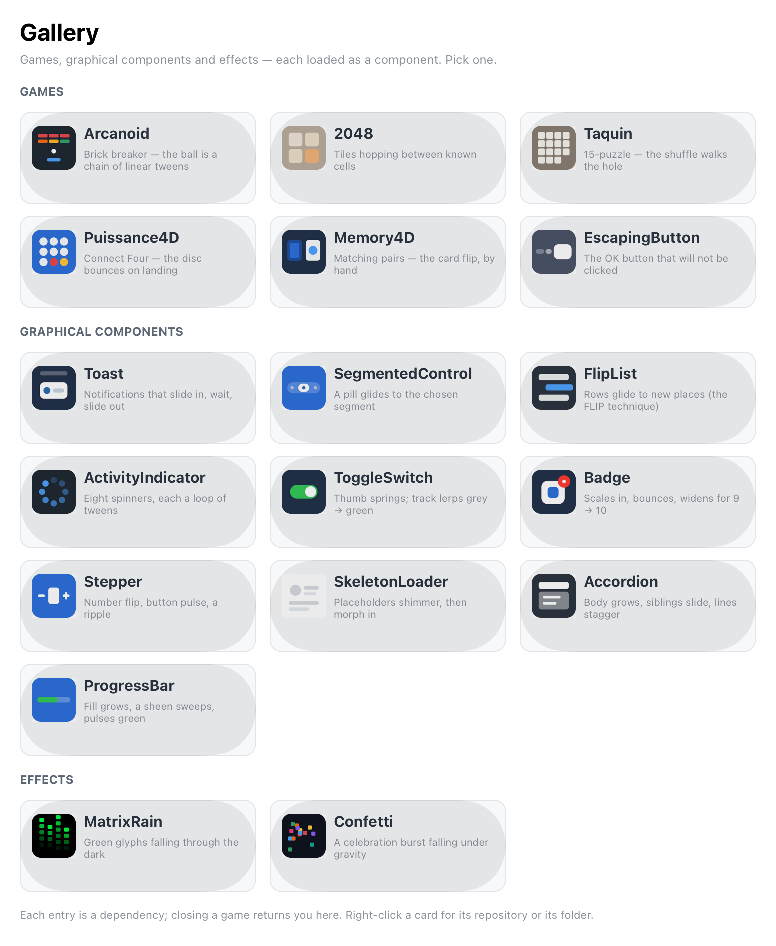

# PlayGallery

**A gallery of the projects built on [Hero](https://github.com/mesopelagique/Hero).** Each one is loaded as a component and launched from a card.

## Run it

Open the project — `On Startup` shows the gallery. Click **Play** on a card; closing that window returns you here.

Right-click a card to reach the project behind it: **Open on GitHub**, or **Show in Finder**. The folder shown is the one the component was actually loaded from — the dependency cache for a component downloaded from a release, or your own working copy when `environment4d.json` redirects that dependency to it.

## In the gallery

The cards are grouped the same way the window is: games, graphical components, then effects.

### Games

| Project | What it is |
|---|---|
| [ArcanoidGame](https://github.com/mesopelagique/ArcanoidGame) | Brick breaker — the ball is a chain of linear tweens, so it cannot tunnel |
| [2048](https://github.com/mesopelagique/2048) | Tiles hopping between known cells |
| [Taquin](https://github.com/mesopelagique/Taquin) | 15-puzzle on a cut-up picture; the shuffle walks the hole, so it is always solvable |
| [Puissance4D](https://github.com/mesopelagique/Puissance4D) | Connect Four — the fall is one tween, bounced on landing |
| [Memory4D](https://github.com/mesopelagique/Memory4D) | Matching pairs of 4D icons; the card flip is a matched-geometry move by hand |
| [EscapingButton](https://github.com/mesopelagique/EscapingButton) | The OK button that will not be clicked |

### Graphical components

| Project | What it is |
|---|---|
| [Toast](https://github.com/mesopelagique/Toast) | Notifications that slide in, wait, and slide out — the dwell is `.delay()` on the exit tween |
| [SegmentedControl](https://github.com/mesopelagique/SegmentedControl) | One pill tweened to the chosen segment's own box — matchedGeometry, straight |
| [FlipList](https://github.com/mesopelagique/FlipList) | Add, remove, shuffle — the rows glide to new places via `capture()`+`heroFrom()` (the FLIP technique) |
| [ActivityIndicator](https://github.com/mesopelagique/ActivityIndicator) | Eight spinners, each one a loop of tweens |
| [ToggleSwitch](https://github.com/mesopelagique/ToggleSwitch) | iOS switch — the thumb springs over, the track lerps grey → green |
| [Badge](https://github.com/mesopelagique/Badge) | A count badge that scales in, bounces, and widens for 9 → 10 |
| [Stepper](https://github.com/mesopelagique/Stepper) | +/– with a number flip, a button pulse, and a ripple |
| [SkeletonLoader](https://github.com/mesopelagique/SkeletonLoader) | Placeholders shimmer, then `share()` morphs them into the real content |
| [Accordion](https://github.com/mesopelagique/Accordion) | A body grows, the siblings slide down, the lines fade in staggered |
| [ProgressBar](https://github.com/mesopelagique/ProgressBar) | The fill grows, a sheen sweeps across, and it pulses green at 100% |

### Effects

| Project | What it is |
|---|---|
| [MatrixRain](https://github.com/mesopelagique/MatrixRain) | Green glyphs falling through the dark |
| [Confetti](https://github.com/mesopelagique/Confetti) | A celebration burst falling under gravity |
